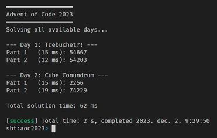

# aoc2023

Solutions, tests and framework for Advent of Code 2023 in Scala 3.  
  


## Requirements

### Option A: dev container

- Visual Studio Code
- Docker

Open the repository with VS Code in the dev container defined in `.devcontainer/devcontainer.json` and run `sbt` in the repository root directory.
Might need to run something like `sudo chown -R vscode:vscode /workspaces/aoc2023`, I did not figure out the devcontainers yet.

### Option B: Scala Build Tool

- Scala Build Tool (SBT) 1.9.7+
  
Install SBT and run `sbt` in the repository root directory.

## Commands

Use `sbt "<command>"`, or start `sbt` and enter one of the commands:

- Run solutions:  
`run [ all | last | <days...> ]`
- Test solutions:  
`test` | `test-<day>`
- Scaffold solutions:  
 Create solution, test and input files by getting info from [adventofcode.com](https://adventofcode.com).  
`run scaffold [reload] [ <days...> | input [<days...>] | inputs ]`

### Examples

- `run` / `run all` - Run all available solutions.
- `run last` - Run the latest available solution.
- `run 1 2` / `run day 1 2 3` - Run solutions for the given days.
- `run scaffold` - Scaffold the earliest missing solution.
- `run scaffold 1 2` / `run scaffold day 1 2 3` - Scaffold the given days.
- `run scaffold inputs` - Download inputs for all implemented solutions.
- `run scaffold input 1 2` - Download inputs for the given days.
- `run scaffold reload input 1 2` - Re-download the input for the given days, invalidating the cache.
- `test` - Run all tests.
- `test-12` - Run tests for day 12.

## Configuration options

The app generates `config.json` on first run:

```jsonc
{
    // Copy the last successful result to the clipboard
    "copyResultToClipboard": false,
    // The event year to use for puzzle info from adventofcode.com
    "eventYear" : 2023,
    // Open the scaffolded files using the editor defined in "pathToEditor"
    "openScaffoldedFiles": false,
    // The editor "openScaffoldedFiles" uses
    "pathToEditor": "C:\\Program Files\\Microsoft VS Code\\Code.exe",
    // Your Advent of Code session key used to get your puzzle input
    "sessionCookie": "YOUR_SESSION_COOKIE"
}
```

## Advent of Code Automation

This repository does follow the automation guidelines on the /r/adventofcode [community wiki](https://www.reddit.com/r/adventofcode/wiki/faqs/automation). Specifically:

- Outbound calls are only triggered manually, by `sbt> run scaffold [...]` -> `Main.scaffold()`
- All successful web requests are cached locally in `.cache/` by `WebClient.requestCached()`
- If you suspect your input is corrupted, you can manually request a fresh copy by `sbt> run scaffold reload input <day>`
- The User-Agent header in `WebClient.request()` is set to me since I maintain this repository.
